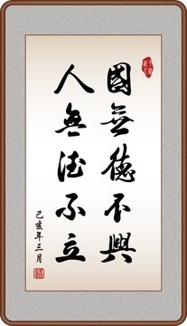

### 【德】

处弱势，能自强不息，不自暴自弃。\
处强势，能谦卑慈善，不胡作非为。

这既是做人之德，也是为国之德。"人无德不立"，"国无德不威” 。

然而，古今中外，总有缺德之人和缺德之国。

尤其是缺德之强人和缺德之强国。前者危害社会和谐，后者危害世界和平。

不幸的是这两者都处在食物链的顶端，缺乏约束，可以肆无忌惮，为所欲为。

强人夺利，强国争霸的结果就是 "兴，百姓苦; 亡，百姓苦"。因为百姓和弱国都处在食物链的底层。

### 注：
- "人无德不立，业无德不兴，国无德不威"出自西汉刘向【战国策】
- “兴，百姓苦; 亡，百姓苦" 出自元朝张养浩【山坡羊·潼关怀古】 

