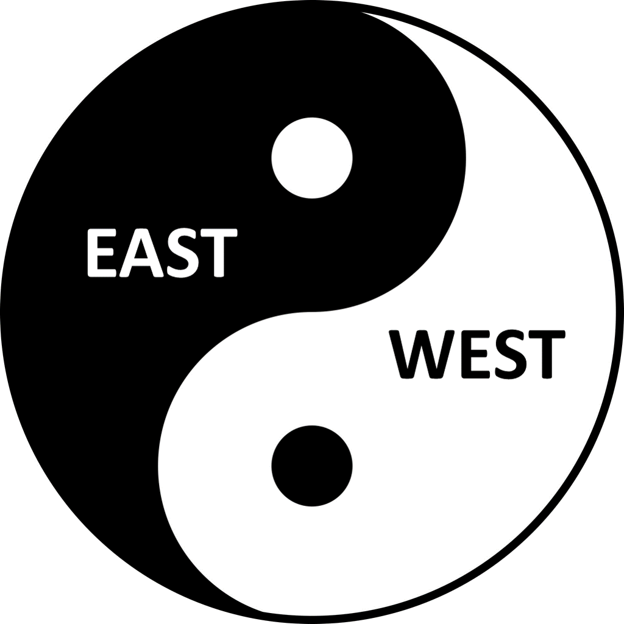

# 【东西半球 阴阳失衡】

当今世界何以如此动乱？简言之，就是东西半球，阴阳失衡。
- 西方在经济和军事上的绝对优势，造成在国际事务中西方强国对东方弱国的 “任性” 和 “任意” 。这应该说是极端主义和恐怖主义出现的根源。强者任意，富者任性，终结恶果。
- 工业革命以来资本主义的高速发展造成贫富两级的巨大差距，同时自然生态的破坏，人性道德的败坏引发了社会的不安和动乱。个人失去健康，幸福，和内在和谐，人与人之间失去和谐，最终结果是社会，国家，世界失去和谐。
- 片面强调科学技术的发展和创新而忽略人文艺术，人的身心健康，人的互相理解容忍，和谐共处。这表现在疾病丛生，婚姻破裂，家庭离散，暴力犯罪增加。

总的来说，科技在进步，经济在发展，人类文明却在倒退。

有什么办法吗？有的，那就是阴阳平衡。

要致力于东西方的平衡，科技和人文的平衡，贫富强弱的平衡。东方要学习西方的先进科技，发展经济，提高国力，但也要吸取西方片面追求科技和经济的教训。
西方要学习东方的智慧，以人为本，开始注重个人健康和幸福，社会和谐，在国际上，要帮助落后贫穷国家，在国际事务中，放弃武力干预，停止把自己的制度和意思形态强加于他国。

东西半球构成世界的一个整体，犹如阴和阳构成太极的一个整体。东西半球失衡，地球在宇宙之中就不稳定，搞不好要掉下来的。大家要特别注意。

