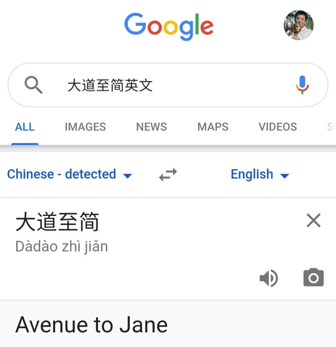

# 【人工智能与人类智慧之别】

谷歌译器 (Google Translate) 算是一种人工智能。我让它把 "大道至简" 翻成英文。
它给的答案是 "Avenue to Jane"。意思是 "大街通到简的家"。让人捧腹。

这是直译。Avenue 是大道，指南北走向的大路 (Street 指东西走向的小街)。
比如纽约曼哈顿的第五大道就是 "The Fifth Avenue"。Jane 是简，西方女人名字。
比如名著 [简爱] 的女主人名简 (Jane)，姓爱(Eyre)。

我则把 "大道至简" 翻成 "The Tao is subtle yet simple"。这是意译，信，达，雅兼俱。

不过，人工智能也有其优越之处。比如我要是和阿法狗 (AlphaGo) 对弈，我必定一败涂地。

在处理复杂模糊，无规可循的问题上，人类智慧高于人工智能。

在处理机械重复，有规可循的问题上，人工智能强于人类智慧。

这个结论可以推而广之，用来比较科学与哲学之别，西方文化与东方文化之别。

