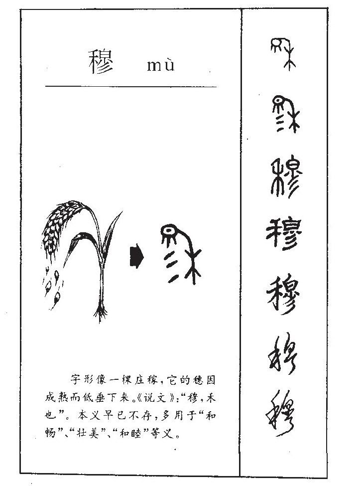

### 【穆】

【说文解字】对穆字的解说极其简单：穆，禾也。从禾㣎声。

译成白话就是: 穆，禾谷。字形采用“禾”作边旁，"㣎"是声旁。

穆字的甲骨文像成熟而下垂的稻穗(参见插图)，象征美好，和睦，庄严，恭敬, 体现了先人对农耕之依赖和重视。
比如【诗经 • 泮水】其中一句: 穆穆魯侯，敬明其德。意思是鲁侯庄重又和美，他的品德光耀且可敬。

为了弥补【说文解字】之不足，我对穆字的右半部作了进一步解剖。”㣎”可分为上中下三个部分：

上面是”白”, 由一撇和一日组成。一撇像是一抹云。日是太阳。阳光透过一抹云而成”白“字。
由此可见洁净的白色与亮丽的阳光有千十丝万缕之联系。

中间是”小”，形似一叶孤舟，左右各有一桨。

下面是”川”，形似水波，代表河流。

综合起来，穆字就是一幅吉祥美丽，水穆阳华的田园诗画:

~~~
小河缓缓流，小舟轻轻荡。  
阳光透祥云，照耀禾苗壮。
~~~

汉字作为最古老，最美妙的数据可视化， 从穆字便可略见一斑。

