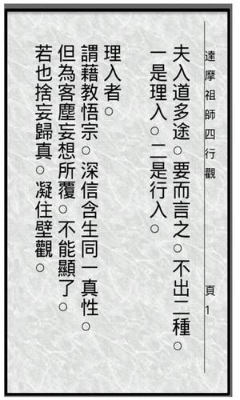

## 五绝两首 • 如是我闻 • 新韵
### （一）
五眼谁为首? 金砖你最萌!\
莫学他霸道，发展利苍生。

### 注：
- 五眼联盟（FVEY）：美国，加拿大，英国，澳大利亚，新西兰。美国为首。 
- 金砖五国（BRICS）：巴西，俄罗斯，印度，中国，南非。中国最亮。

### （二）
入道有多途，无分社与资。\
黑白非对立，灰色蕴真如。

### 注：
- “入道多途”出自禅宗初祖达摩的【二入四行观】。
- 西方谚语也有“条条大道通罗马（All roads lead to Rome)”。

